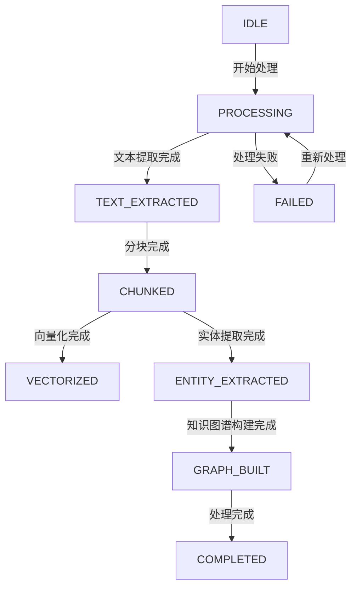

# 知识库分层架构设计方案

## 1. 架构概述

### 1.1 设计目标
- 实现知识库的分层管理，包括片段级、文档级、知识库级、全局级
- 统一管理文档处理流程，确保各阶段状态一致
- 提供清晰的状态管理和流程控制
- 支持并行处理和高效的实体识别

### 1.2 核心概念
- **文档(Document)**: 上传的原始文件，如PDF、Word等
- **片段(Chunk)**: 文档经过分块后的基本单位
- **实体(Entity)**: 从文本中提取的具有特定含义的概念
- **知识图谱(Knowledge Graph)**: 基于实体和关系构建的图结构

## 2. 分层架构设计

### 2.1 层级结构

| 层级 | 名称 | 描述 | 核心功能 |
|------|------|------|----------|
| Level 1 | 片段级 | 文档分块后的基本单位 | 文本分块、向量嵌入、片段级实体识别 |
| Level 2 | 文档级 | 由多个片段组成的完整文档 | 文档级实体聚合、文档级关系提取 |
| Level 3 | 知识库级 | 多个文档的集合 | 知识库级实体对齐、跨文档实体关联 |
| Level 4 | 全局级 | 多个知识库的集合 | 全局实体对齐、跨知识库知识融合 |

### 2.2 数据模型

#### 2.2.1 核心数据表
- **KnowledgeBase**: 知识库信息
- **KnowledgeDocument**: 文档信息
- **DocumentChunk**: 文档片段
- **ChunkEntity**: 片段级实体
- **DocumentEntity**: 文档级实体
- **KnowledgeGraphNode**: 知识图谱节点
- **KnowledgeGraphEdge**: 知识图谱边

#### 2.2.2 状态管理
使用 `DocumentProcessingStatus` 枚举统一管理文档处理状态：

| 状态 | 描述 | 前置条件 | 后续操作 |
|------|------|----------|----------|
| IDLE | 待处理 | 无 | 开始处理 |
| PROCESSING | 处理中 | 任何状态 | 继续处理 |
| TEXT_EXTRACTED | 文本提取完成 | IDLE | 分块处理 |
| CHUNKED | 切片完成 | TEXT_EXTRACTED | 向量化/实体识别 |
| ENTITY_EXTRACTED | 实体提取完成 | CHUNKED | 知识图谱构建 |
| VECTORIZED | 向量化完成 | CHUNKED | 检索服务 |
| GRAPH_BUILT | 知识图谱构建完成 | ENTITY_EXTRACTED | 完成 |
| COMPLETED | 处理完成 | GRAPH_BUILT | 无 |
| FAILED | 处理失败 | 任何状态 | 重新处理 |

## 3. 处理流程设计

### 3.1 核心流程

1. **文档上传**：用户上传文档到知识库
2. **文本提取**：从文档中提取文本内容
3. **智能分块**：将文本分割成合理大小的片段
4. **向量化处理**：为每个片段生成向量嵌入
5. **实体识别**：识别片段中的实体和关系
6. **实体聚合**：将片段级实体聚合为文档级实体
7. **实体对齐**：在知识库级别对齐实体
8. **知识图谱构建**：基于实体和关系构建知识图谱

### 3.2 流程控制

- **前置条件验证**：每个处理阶段必须验证前置条件
- **状态一致性**：确保各阶段状态保存一致
- **错误处理**：详细记录处理过程中的错误
- **进度跟踪**：实时跟踪处理进度

### 3.3 并行处理

- **片段级并行**：使用线程池并行处理片段级实体识别
- **文档级并行**：支持多个文档同时处理
- **批量处理**：支持批量文档处理

## 4. 接口设计

### 4.1 后端 API

| 接口 | 方法 | 描述 |
|------|------|------|
| `/api/v1/knowledge/documents/{document_id}/status` | GET | 获取文档处理状态 |
| `/api/v1/knowledge/documents/{document_id}/vectorize` | POST | 执行文档向量化 |
| `/api/v1/knowledge/documents/{document_id}/extract-entities` | POST | 执行片段级实体识别 |
| `/api/v1/knowledge/documents/{document_id}/aggregate-entities` | POST | 执行文档级实体聚合 |
| `/api/v1/knowledge/knowledge-bases/{knowledge_base_id}/processing-summary` | GET | 获取知识库处理状态摘要 |
| `/api/v1/knowledge/documents/{document_id}/validate-preconditions` | POST | 验证文档处理前置条件 |

### 4.2 前端 API

| 方法 | 描述 | 参数 |
|------|------|------|
| `getDocumentProcessingStatus` | 获取文档处理状态 | documentId |
| `vectorizeDocument` | 执行文档向量化 | documentId, knowledgeBaseId |
| `extractDocumentEntities` | 执行片段级实体识别 | documentId, maxWorkers |
| `aggregateDocumentEntities` | 执行文档级实体聚合 | documentId, similarityThreshold |
| `getKnowledgeBaseProcessingSummary` | 获取知识库处理状态摘要 | knowledgeBaseId |
| `validateDocumentPreconditions` | 验证文档处理前置条件 | documentId, targetStage |

## 5. 组件设计

### 5.1 后端服务

| 服务 | 描述 | 核心功能 |
|------|------|----------|
| `DocumentProcessingService` | 文档处理流程管理 | 流程控制、状态管理、前置条件验证 |
| `DocumentProcessor` | 文档处理器 | 文档解析、分块、向量化 |
| `ChunkEntityService` | 片段级实体服务 | 片段级实体识别 |
| `DocumentEntityService` | 文档级实体服务 | 文档级实体聚合 |

### 5.2 前端组件

| 组件 | 描述 | 核心功能 |
|------|------|----------|
| `ProcessingFlowPanel` | 处理流程面板 | 展示处理流程、执行处理步骤 |
| `ProcessingDocumentsPanel` | 处理中文档面板 | 展示处理进度、处理状态 |
| `DocumentCard` | 文档卡片 | 展示文档基本信息、状态 |

## 6. 状态管理

### 6.1 状态流转

### 6.2 状态验证

- **向量化**：要求文档状态为 `TEXT_EXTRACTED` 或 `CHUNKING_FAILED`
- **实体识别**：要求文档状态为 `CHUNKED` 或 `ENTITY_EXTRACTION_FAILED`
- **实体聚合**：要求文档状态为 `ENTITY_EXTRACTED` 或 `ENTITY_EXTRACTION_FAILED`
- **知识图谱构建**：要求文档状态为 `ENTITY_EXTRACTED` 或 `GRAPH_BUILDING_FAILED`

## 7. 性能优化

### 7.1 并行处理
- 使用线程池并行处理片段级实体识别
- 支持批量文档处理
- 优化数据库查询和事务处理

### 7.2 内存管理
- 主动释放内存，避免内存泄漏
- 使用流式处理大文件
- 优化向量存储和检索

### 7.3 缓存策略
- 缓存处理结果，避免重复处理
- 使用 Redis 缓存热点数据
- 优化数据库索引

## 8. 错误处理

### 8.1 错误类型

| 错误类型 | 描述 | 处理策略 |
|----------|------|----------|
| 文本提取失败 | 无法从文档中提取文本 | 记录错误，标记为 `TEXT_EXTRACTION_FAILED` |
| 分块失败 | 文档分块过程中出错 | 记录错误，标记为 `CHUNKING_FAILED` |
| 实体识别失败 | 实体识别过程中出错 | 记录错误，标记为 `ENTITY_EXTRACTION_FAILED` |
| 向量化失败 | 向量化过程中出错 | 记录错误，标记为 `VECTORIZATION_FAILED` |
| 知识图谱构建失败 | 知识图谱构建过程中出错 | 记录错误，标记为 `GRAPH_BUILDING_FAILED` |

### 8.2 错误恢复
- 支持从失败状态重新开始处理
- 详细记录错误信息，便于排查
- 提供错误重试机制

## 9. 部署与监控

### 9.1 部署架构
- 后端服务：FastAPI 应用
- 前端应用：React 应用
- 数据库：SQLite/PostgreSQL
- 向量存储：ChromaDB

### 9.2 监控指标
- 处理成功率
- 处理时间
- 内存使用
- 并发数

### 9.3 日志管理
- 详细的处理日志
- 错误日志
- 性能日志

## 10. 未来扩展

### 10.1 功能扩展
- 支持更多文件格式
- 集成更多实体识别模型
- 支持跨语言实体对齐
- 提供知识图谱可视化工具

### 10.2 性能扩展
- 支持分布式处理
- 优化向量存储和检索
- 实现增量处理
- 支持实时处理

### 10.3 集成扩展
- 与 LLM 集成，提供智能问答
- 与其他系统集成，如 CRM、ERP 等
- 支持 API 接口调用

## 11. 总结

知识库分层架构设计方案通过清晰的层级结构、统一的状态管理和高效的处理流程，实现了知识库的精细化管理。该方案支持从文档上传到知识图谱构建的完整流程，确保各阶段状态一致，处理流程可控。同时，通过并行处理和性能优化，提高了处理效率，为用户提供了更好的体验。
